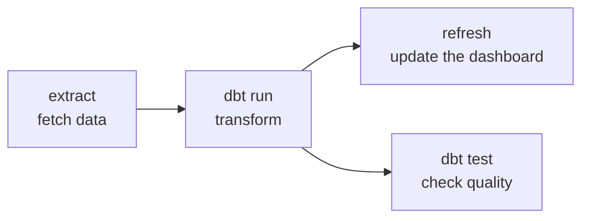

:::tip[In short]
Airflow is a pipeline orchestrator: you describe a **DAG** (a graph of tasks with dependencies) in Python, and Airflow runs the tasks **on a schedule** in the right order, tracks status and reruns failures. An analyst usually doesn't need to write DAGs from scratch — they need to understand how to read a pipeline, where to find logs and what backfill is.
:::

:::note[Data flow]
Input: a schedule or an external trigger
→ Processing: the DAG runs tasks in the right order (extract → dbt → refresh), tracks status, reruns failures
→ Output: refreshed marts and dashboards on schedule.
Why: automation and control of the pipeline — data updates itself, and you can see where things broke.
:::

## Why you need it

A report must update itself: at night fetch data → transform ([dbt](/en/11-modern-stack/05-dbt-basics/)) → refresh the dashboard. Airflow ties these steps into a managed process. Seeing why "yesterday's data didn't update" and reading the task graph is a working skill in teams with a DWH.

## What Airflow is

A tool for **orchestrating** (managing the order and schedule of) data-processing tasks. It doesn't process data itself — it's the **conductor**: it says what to run and when, and in what sequence.

## DAG and tasks

A **DAG** (Directed Acyclic Graph) is a graph of tasks without cycles: tasks and dependency arrows of "what comes after what".



- **Task** — a single step (fetch a file, run SQL, run dbt).
- Arrows set the order: `C` doesn't start until `B` is done.
- A DAG is described in Python code (schedule, tasks, dependencies).

What a minimal DAG looks like in code:

```python
from airflow import DAG
from airflow.operators.bash import BashOperator
import pendulum

with DAG(
    dag_id="daily_marts",
    schedule="0 6 * * *",                  # every day at 06:00 (cron)
    start_date=pendulum.datetime(2026, 1, 1),
    catchup=False,                          # don't auto-backfill all missed days
) as dag:
    extract = BashOperator(task_id="extract", bash_command="python extract.py")
    transform = BashOperator(task_id="dbt_run", bash_command="dbt build")
    extract >> transform                    # order: extract first, then dbt
```

## Basic operators

A task is created by an **operator** — a template for a type of work:

- **PythonOperator** — run a Python function.
- **BashOperator** — a shell command.
- **SQL operators** — a query to a DB/DWH.
- **Sensor** — wait for an event (a file appeared, a source table is ready).
- Ready-made integrations — running dbt, extracting from sources, etc.

:::caution[Tasks must be idempotent]
Airflow reruns failed tasks (`retries`) and runs backfills — so re-running for the same day **must not** double the data. Write steps so a rerun gives the same result: not a blind `INSERT`, but overwriting a partition / a `MERGE` by key for the run's date. A non-idempotent pipeline will double the revenue on the very first retry.
:::

## Scheduling

A DAG has a **schedule** (a cron expression or a preset like `@daily`): Airflow runs it at the right time and tracks each run. The UI shows the history: what passed, what failed, task logs.

## Backfill

:::tip[Backfill — catch up on missed periods]
If a pipeline was added later or sat idle, **backfill** runs the DAG retroactively for past dates to fill in historical data. Airflow parameterizes a run by date (`execution_date`), so the same logic can run for any day. It's a frequent operation — "recompute the mart for last month".
:::

## Alternatives

Airflow is the standard, but there are modern competitors: **Prefect** and **Dagster** — more convenient for development and testing, with a more "Pythonic" API. The idea is the same for all (pipeline orchestration); knowing they exist is useful, but Airflow is still the most common.

## Practice tasks

<details>
<summary>1. Does Airflow process data itself?</summary>

No, Airflow is an orchestrator: it decides what to run and when and in what order (per the DAG), but the processing itself is done by the invoked steps — SQL in the DWH, dbt, Python scripts. It's the "conductor", not the "performer". Confusing orchestration with processing is a common mistake.

</details>

<details>
<summary>2. The pipeline was set up only today, but you need marts for last month too. What to use?</summary>

Backfill: run the DAG retroactively for past dates to fill in historical data. Airflow parameterizes a run by execution date, so the same logic can run for any period. It's the built-in mechanism to "compute the past".

</details>

## What's next

- [Data modeling](/en/11-modern-stack/07-data-modeling/) — how to design the marts the pipeline builds.
- [dbt](/en/11-modern-stack/05-dbt-basics/) — a frequent step inside an Airflow DAG.
