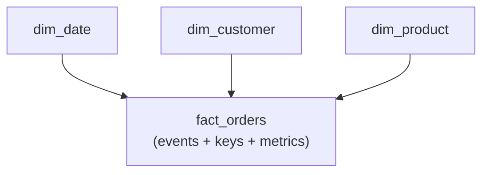

:::tip[In short]
Data modeling is how to organize DWH tables for analytics. The standard is the **Kimball approach** and a **star schema**: a central **fact** table (events: orders, clicks) surrounded by **dimension** tables (references: customers, products, dates). It's the same star as in [Power BI](/en/07-bi-tools/power-bi/03-data-model/), but at the level of the whole warehouse.
:::

## Why you need it

A good model = simple fast queries and clear dashboards; a bad one = pain, duplicates and slow joins. An analyst both reads such models and (at middle+) designs marts. Kimball terminology is asked in DWH interviews.

## Approaches: Kimball, Inmon, Data Vault

| Approach | Idea | Where |
|----------|------|-------|
| **Kimball** | dimensional modeling, star schema "bottom-up" | the de facto analytics standard |
| **Inmon** | a normalized enterprise warehouse first, "top-down" | large traditional DWHs |
| **Data Vault** | a flexible model for frequent source changes | complex changing landscapes |

For an analyst the main thing is **Kimball/star schema**; the rest is useful to know by name.

## Star schema: facts and dimensions

- **Facts** — measurable events: one row = an order/click/payment. They hold metrics (`amount`, `quantity`) and keys to dimensions.
- **Dimensions** — context: who, what, when, where. References of customers, products, dates.

A query "revenue by category for the quarter" = join the fact with dimensions and `GROUP BY` — simple and fast.

:::caution[Kimball's first step — declare the grain]
Before designing a fact table, clearly state **what one row is**: "one row = one order line item" or "one order" or "one payment". That's the **grain**. All metrics and keys must match this level. The most common mistake is mixing grains (order lines and the order itself in one table) → doubled sums on aggregation. State the grain in one sentence — then everything else designs itself unambiguously.
:::

## Snowflake schema

If you further normalize dimensions (product → category → department as separate tables), the star turns into a **snowflake**. Less duplication, but more joins and more complex queries. In analytics people usually prefer the "flattened" star for speed and simplicity.

## Slowly Changing Dimensions (SCD)

:::caution[Dimension attributes change over time — how to store history?]
A customer moved from Moscow to Berlin. What to do with old orders? That's the **SCD** problem:

- **SCD Type 1** — overwrite (lose history): everywhere it's now Berlin.
- **SCD Type 2** — add a new version row with validity dates (keep history): old orders stay with Moscow, new ones with Berlin.

The choice is critical: with Type 1 historical reports "rewrite themselves" retroactively. For correct analysis over time you more often need **Type 2**.
:::

What an SCD Type 2 dimension looks like — the customer has two version rows with validity intervals and a "current" flag:

| customer_sk | customer_id | city | valid_from | valid_to | is_current |
|-------------|-------------|------|------------|----------|------------|
| 101 | C-1 | Moscow | 2024-01-01 | 2026-03-15 | false |
| 102 | C-1 | Berlin | 2026-03-15 | 9999-12-31 | true |

A fact references `customer_sk` (the surrogate key of the specific version), so an old order is forever tied to "Moscow" and a new one to "Berlin". A "current state" report filters `is_current = true`.

## Surrogate keys

In dimensions, instead of a "natural" business key (email, SKU) a **surrogate** key is introduced — a technical id (1, 2, 3…). Why: business keys change and aren't unique over time (especially with SCD Type 2, where one customer has several version rows), while a surrogate is stable and compact for joins.

## Practice tasks

1. Where do "orders" go and where does the "customer reference" go in a star schema?

Orders are a fact table (measurable events, one row = an order, with metrics and keys). The customer reference is a dimension table (the "who" context). Facts in the center, dimensions around; queries join facts with dimensions and aggregate metrics.

2. A customer changed city. Why does it matter whether it's SCD Type 1 or Type 2?

With Type 1 the city is overwritten, and all past reports "move" to the new city — history is distorted. With Type 2 a new version row with dates is created, old orders keep the former city. For correct "as it was at the time" analysis you need Type 2; Type 1 is simpler but loses history.

## What's next

- [Data quality](/en/11-modern-stack/08-data-quality/) — how to test the built model.
- [Power BI data model](/en/07-bi-tools/power-bi/03-data-model/) — star schema at the BI level.
