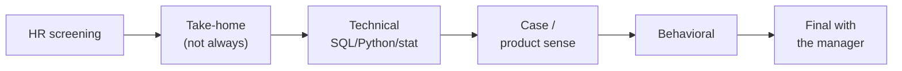

:::tip[In short]
A typical DA hiring process is a **funnel of 4–6 stages**: HR screening → (sometimes) a take-home → technical interview (SQL/Python/statistics) → a product-sense case → behavioral → final with the manager. Knowing the stages in advance, you prepare for each precisely instead of panicking "what will they even ask".
:::

## Why you need it

Each stage checks its own thing and filters for different reasons. Understanding the structure helps you see **where exactly** you lose offers and prepare specifically. It's the same [funnel with per-step conversion](/en/08-product-analytics/03-funnels/), just about you.

## The stages

### HR screening

A short call (20–30 min): motivation, experience in general terms, salary expectations, location/format. HR's goal is to filter out obvious mismatches. **State a range** in advance to avoid wasting time.

### Take-home assignment

Not always present. Usually SQL tasks and/or a mini dataset analysis with conclusions.

:::caution[A take-home shouldn't be free labor]
An adequate take-home is 2–4 hours on learning/anonymized data. If they ask you to build a real working dashboard for their company on "real" data, unpaid and over many hours — that's a red flag. A reasonable scope is fine, exploitation isn't.
:::

### Technical interview

The core of analyst selection: [SQL, Python/pandas, statistics](/en/12-career/05-technical-interview/), often live coding. This decides whether you command the tools.

### Case / product sense

A [business task with no single answer](/en/12-career/06-case-interview/): "a metric dropped, figure it out", "how to measure a feature's success". They check thinking, not memorization.

### Behavioral

[Questions about experience and soft skills](/en/12-career/07-behavioral-interview/) by STAR: conflicts, mistakes, teamwork. They check what it'll be like to work with you.

### Final with the manager

The future boss assesses "fit or not", discusses the team's tasks. Often the final [salary negotiation](/en/12-career/08-salary-negotiation/) happens here too.

## Timings

The whole process usually takes **2–5 weeks** (longer at large companies). Between stages — days to weeks. That's normal; keep several processes in parallel, so you don't depend on one and have leverage in negotiation.

1. They ask you to build a working dashboard on real company data, ~15 hours, unpaid, as a take-home. Normal?

A red flag. An adequate take-home is 2–4 hours on learning/anonymized data and checks a skill, not solves the company's work task. Many hours on their real data without pay looks like free exploitation — worth clarifying the terms or being wary.

2. You consistently reach the tech interview but go no further. Where to dig?

The problem is localized at the technical stage — meaning SQL/Python/statistics or live coding under pressure are weak. You pass the resume and screening (the funnel entrance is fine), so the prep focus is exactly practicing technical tasks (LeetCode/StrataScratch) and talking through your solution aloud.

## What's next

- [Technical interview](/en/12-career/05-technical-interview/) — the core of selection.
- [Case interview](/en/12-career/06-case-interview/) — product thinking.
