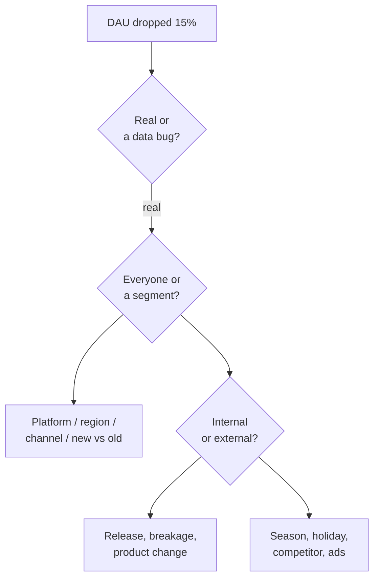

:::tip[In short]
A case interview tests **thinking, not syntax knowledge**. The key is not to blurt an answer but to **structure**: clarify the question, break it into parts, talk through hypotheses. The most common type is diagnosing "why a metric dropped": you decompose it into factors and check each in turn. Everything from [product analytics](/en/08-product-analytics/01-key-metrics/) comes in handy here.
:::

## Why you need it

A technically strong but "non-thinking" analyst is useless to the business. Cases check whether you can turn a vague question into an analysis plan — what sets a middle apart from a junior. There's no "textbook" answer here; they assess the approach.

## The answer framework

:::tip[Structure first, answer second]
The main mistake is to immediately blurt "probably a bug". The right way:

1. **Clarify** the question and context (period, segment, how the metric is computed).
2. **Decompose** into parts/factors.
3. **Propose hypotheses** and say how you'll check each.
4. **State a conclusion** and the next step.

Think aloud — they assess the reasoning.
:::

## Estimation (Fermi tasks)

"How many taxis are in Moscow?", "how many pizzas does a city eat in a day?". The exact number doesn't matter — the **estimation logic** does: break it into understandable factors (population → share who order → frequency → average check) and approximate step by step. They check structured thinking and working with assumptions.

## Metric diagnosis

A classic: "DAU dropped 15% in a week — why?". The algorithm:

1. **Clarify**: did it really drop (not a logging bug)? over what period? sharply or gradually?
2. **Segment**: everyone or a part — platform (iOS/Android), region, new/old, channel?
3. **Internal vs external**: a release/product change vs seasonality/holiday/competitor/marketing.
4. **Decomposition**: DAU = new + returning + retained — which part sagged?

## Metric design

"How to measure the success of a new feature / recommendation feed?". The approach: what we want to achieve → which **single main metric** reflects it (not revenue directly, but value) → plus guardrail metrics for "what not to break". Directly linked to [the North Star and OEC](/en/08-product-analytics/10-product-frameworks/).

## A/B test design

"How to verify that a feature helps?". Walk through the [A/B](/en/09-ab-testing/02-hypothesis-design/) steps: hypothesis → primary + guardrail metrics → randomization unit → sample size/timeframe → how to analyze. Show that you remember the pitfalls (peeking, SRM).

## Practice tasks

1. "Conversion to purchase dropped 10%." Is the first step to name a cause?

No. First clarify and structure: did it really drop (not a tracking bug), over what period, sharply or gradually. Then segment (platform, region, channel) and decompose the funnel by step to find where exactly the drop is. You can name a specific cause only after decomposition — otherwise it's guessing.

2. You're asked to estimate "how much coffee your city drinks in a day". How to approach it?

It's a Fermi task: the exact number isn't needed, the logic is. Break it into factors: population → share who drink coffee → average cups per day → (optionally) average price. Talk through assumptions aloud and approximate the order of magnitude. They assess the structure of reasoning, not accuracy.

## What's next

- [Behavioral interview](/en/12-career/07-behavioral-interview/) — questions about experience and soft skills.
- [Product frameworks](/en/08-product-analytics/10-product-frameworks/) — support for metric cases.
